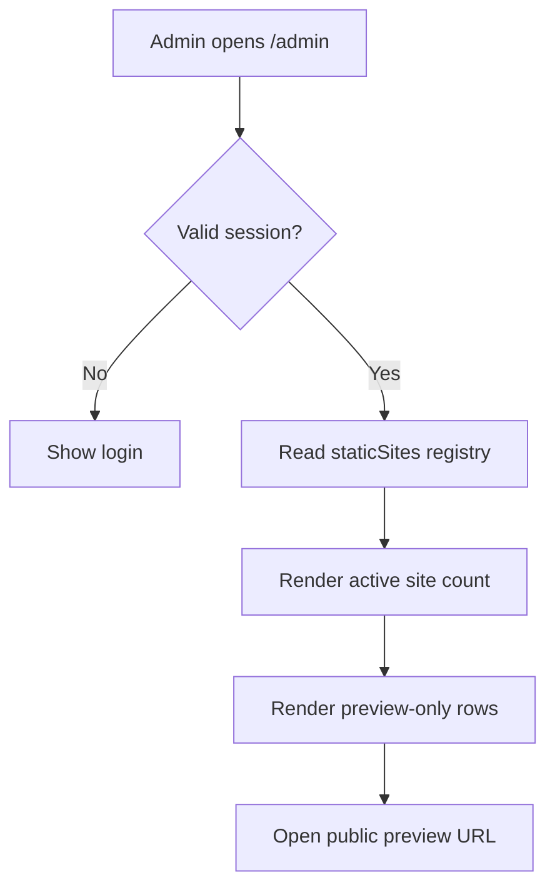

# Active Site Dashboard Plan

## Goal
Replace the admin create-site form with a simple active-site list that shows every pushed static preview site.

## Constraints
- Platform: plain Node.js server-rendered HTML.
- Existing deployment: `client-sites/*` folders are shipped in the Docker image.
- Existing data: JSON database can contain old seed/generated sites that are not the pushed static previews.
- User need: see active client demos quickly after pushing new folders.
- Risk limit: keep public preview routes and password gate unchanged.

## Assumptions
- "Active sites" means static preview folders currently deployed under `client-sites`.
- Creating/editing sites in the dashboard is not needed right now.
- Preview-only actions are enough for this admin view.
- The old JSON seed site should not drive the visible dashboard count.

## Edge Cases
- Static preview folder exists but DB seed does not.
- DB seed exists but static preview folder does not.
- Admin is logged out.
- Admin is logged in.
- Preview URL needs trailing slash.
- Preview should open in a new tab.
- `/health` remains public.
- `/api/sites` remains password-protected.
- Public preview routes remain public.
- Mobile layout should show the list before any dead space.
- Empty static registry should show a clear empty state.
- Count should match the list shown.
- Form text such as "Create site" and "Save site" should not appear.
- Edit/delete controls should not appear for pushed static sites.
- Labels should explain source as "Pushed site".

## Options Considered
- Keep DB as source: rejected because pushed folders can be invisible.
- Merge DB and static folders: maybe later, but risks showing stale seed/generated sites.
- Static registry as source: chosen because it matches pushed/deployed previews.

## Recommended Path
Use `staticSites` as the admin dashboard source of truth. Keep DB routes available for now, but remove create/edit/delete UI from the admin page.

## Flow


## Wireframe
```text
XT3 Demo Platform                         [3 active sites] [Log out]
Active client previews on demo.xt3.us

┌─────────────────────────────────────────────────────────────┐
│ Admin dashboard                                             │
│ Active preview sites.                              3         │
│ These are the live client previews pushed to client-sites.   │
│                                                             │
│ Alexys Nevitt Voice Studio        /alexys...       Preview  │
│ LakeShore Lawn Care               /lakeshore...    Preview  │
│ Pure Pressure Power Washing       /pure...         Preview  │
└─────────────────────────────────────────────────────────────┘
```

## Risks
- If future dynamic sites should return, the dashboard will need a separate "generated sites" section.
- Static site metadata is still manually maintained in `server.js`.
- Existing JSON data remains in the volume but is not the visible dashboard source.

## Acceptance Criteria
- Dashboard has no create form.
- Dashboard shows 3 active sites.
- Alexys Nevitt Voice Studio appears.
- LakeShore Lawn Care appears.
- Pure Pressure Power Washing appears.
- Each row has a preview link.
- Existing auth and public preview behavior still pass tests.
