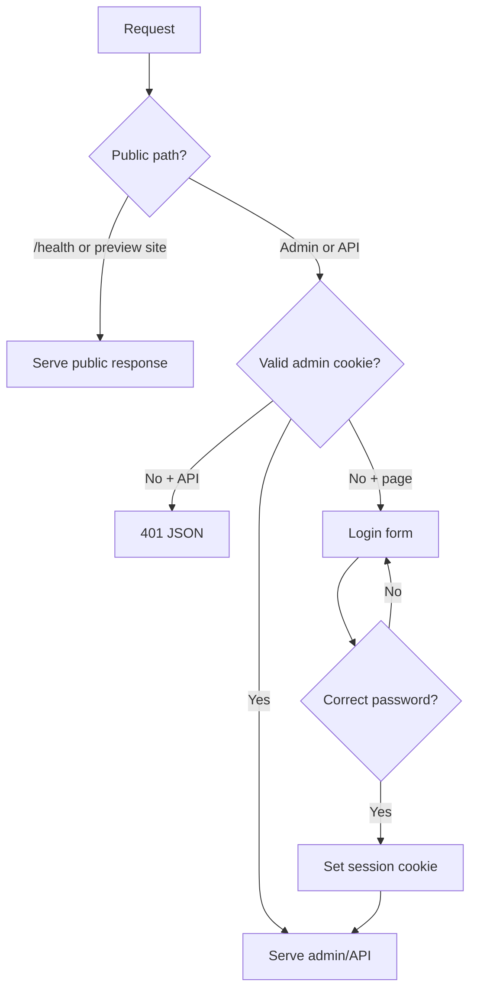

# Admin Password Gate Plan

## Goal
Hide the XT3 Demo Platform admin surface at `demo.xt3.us` behind a password gate while keeping client preview sites public.

## Constraints
- Platform: plain Node.js HTTP server, no framework.
- Existing system: root `/`, `/admin`, and `/api/sites*` are admin surfaces.
- Public demos: published site slugs and static client site paths must remain visible.
- Health checks: `/health` must stay public for deployment monitoring.
- Budget/time: small, direct change with local verification before commit and push.
- Security limit: this is a lightweight shared-password gate, not full user auth.

## Assumptions
- `demo.xt3.us/` and `/admin` should both require the password.
- Admin API writes and reads should also require the same session.
- Public preview URLs should not require the admin password.
- A cookie-based session is enough for this demo platform.
- The provided password is intentional for this deployment.

## Edge Cases
- Missing password submits should be rejected.
- Wrong password should return the login form with a clear error.
- Correct password should set a session cookie and redirect to `/admin`.
- Existing session cookie should allow `/`, `/admin`, and `/api/sites`.
- Missing session should block `/api/sites`.
- `/health` should stay public.
- Static client sites should stay public.
- Dynamic published demo slugs should stay public.
- Draft demo slugs should stay hidden by existing behavior.
- Path traversal in static sites should remain blocked.
- Cookie should be `HttpOnly`, `SameSite=Lax`, and path-scoped to `/`.
- Logout should clear the cookie.
- Unknown paths should still return the existing 404 behavior.
- Non-POST login requests should not process credentials.
- Malformed JSON bodies should not affect auth gate behavior.
- Admin password should support env override through hash or plaintext env.
- Empty configured password should fail closed.
- Session token should not expose the raw password.
- API requests without a cookie should get `401`, not the HTML login page.
- Browser requests without a cookie should get the login page.
- Redirects should not create loops.
- The first local request after server start should not require any seeded data beyond the normal DB seed.
- Cache headers should stay `no-store` for auth pages.
- Existing public asset caching should stay unchanged.
- Mobile login layout should fit the viewport.
- Login form should work without JavaScript.
- Password should handle punctuation such as `!`.

## Options Considered
- HTTP Basic Auth: fastest, but browser UX is rough and logout is awkward.
- Full user system: stronger, but too much for a demo admin.
- Cookie password gate: best fit for speed, control, and clean UX.

## Recommended Path
Use a server-level cookie session gate for admin routes and API routes. Keep preview routes and health checks public.

## Flow


## Wireframe
```text
┌────────────────────────────────────────────┐
│ XT3 Demo Platform                          │
│                                            │
│ Admin access                               │
│ Enter the shared password to continue.     │
│                                            │
│ [ Password __________________________ ]    │
│ [ Continue ]                               │
│                                            │
│ Client preview links stay public.          │
└────────────────────────────────────────────┘
```

## Implementation Plan
1. Add a failing Node test that proves `/admin` and `/api/sites` are blocked without a session.
2. Add cookie parsing, password verification, and session creation helpers.
3. Gate `/`, `/admin`, and `/api/sites*`.
4. Add `/login` and `/logout`.
5. Run narrow tests, then local smoke checks.
6. Inspect diff, commit, and push the branch.

## Risks
- If Coolify injects a different password env later, the gate may use that instead of the default.
- A shared password can be forwarded; this is access hiding, not identity tracking.
- Existing scripts that call `/api/sites` without a cookie will now need login/session handling.

## Acceptance Criteria
- `/admin` returns the password screen without a valid cookie.
- `/api/sites` returns `401` without a valid cookie.
- Correct password redirects into `/admin`.
- Authenticated `/api/sites` returns site data.
- Public preview pages still load without a password.
- `/health` still returns `OK`.
