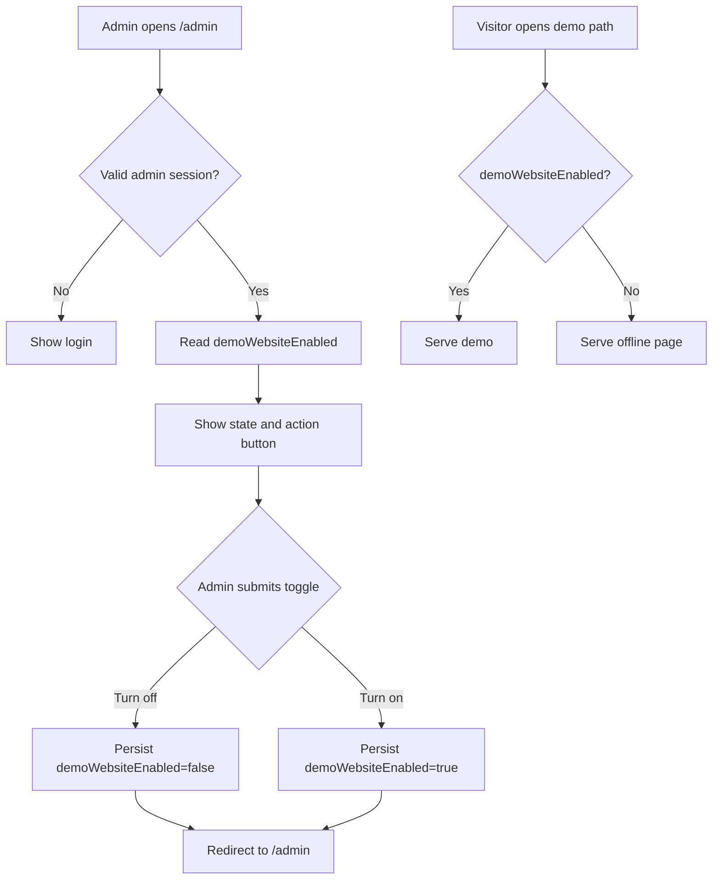

# Demo Website Toggle Plan

## Goal
Allow an admin to easily turn the public demo website on or off from the existing password-gated admin page.

## Mode
New feature.

## User Lens
- User: Ian or another XT3 admin.
- Wants: one clear switch that controls whether client demo previews are public.
- Fears: a client or prospect seeing a demo before it is ready, or losing access to the admin page by mistake.
- Friction to remove: editing files, redeploying, or guessing which site is live.

## Success Metrics
- Admin can turn demos off in one click after login.
- Public preview routes return an offline page within the next request.
- Admin can turn demos back on in one click.
- Existing admin login and `/health` still work.
- Existing tests pass with a new coverage path for off and on states.

## Constraints
- Platform: plain Node.js HTTP server.
- Storage: local JSON data under `DATA_DIR`.
- Auth: existing shared-password admin cookie.
- Time: small direct change.
- Budget: no new service or database.
- Technical limit: no frontend framework or client-side build step.
- Legal/compliance limit: no sensitive data should appear on the offline page.
- Existing system constraint: static demo previews under `client-sites/*` must remain path-based.

## Known Facts
- `/admin` is already password-gated.
- Public static demo folders are served before most admin/API routing.
- `/health` is public and used for deployment checks.
- Existing tests already cover admin auth and the active pushed-site dashboard.

## Assumptions
- "Demo website" means the public client preview pages, not the admin dashboard.
- Admin access should stay available even when demos are off.
- The setting should persist across server restarts.
- A global switch is better than per-site switches for this request.
- A clear offline page is better than a vague 404.

## Fragile Assumptions
- If Ian meant one specific client site, this should become a per-site setting later.
- If the host needs the whole domain hidden, this should move to deployment or reverse-proxy rules later.
- If multiple admins use the tool at once, the last click should win for now.

## Edge Cases
1. Admin is logged out and opens `/admin`.
2. Admin is logged in and opens `/admin`.
3. Admin turns the demo website off.
4. Admin turns the demo website on.
5. Admin clicks the same state twice.
6. Admin submits an unexpected value.
7. Admin submits no value.
8. Admin session cookie is missing.
9. Admin session cookie is stale.
10. Admin session cookie is invalid.
11. Public static demo root is requested while live.
12. Public static demo root is requested while offline.
13. Public static demo asset is requested while offline.
14. Static demo without trailing slash is requested while live.
15. Static demo without trailing slash is requested while offline.
16. Unknown public path is requested while live.
17. Unknown public path is requested while offline.
18. Dynamic JSON-backed demo path is requested while live.
19. Dynamic JSON-backed demo path is requested while offline.
20. Draft dynamic demo path is requested.
21. `/health` is requested while live.
22. `/health` is requested while offline.
23. `/login` is requested while offline.
24. `/logout` is requested while offline.
25. `/api/sites` is requested while offline without auth.
26. `/api/sites` is requested while offline with auth.
27. Server starts with no data directory.
28. Server starts with old `sites.json` that has no settings object.
29. Server starts with malformed state value.
30. Server writes the setting and preserves site data.
31. File write fails.
32. Multiple rapid toggle requests arrive.
33. Browser refreshes admin after toggle.
34. Browser back button returns to an old admin page.
35. Offline page is cached by a browser.
36. Offline page is viewed on mobile.
37. Offline page is viewed on desktop.
38. Offline copy is too technical.
39. Offline state looks like an app crash.
40. Preview button is clicked while offline.
41. Admin needs to see current state quickly.
42. CSS changes break existing dashboard layout.
43. Tests use a temp data directory.
44. Production uses existing persistent data.
45. Environment variable `DATA_DIR` changes.
46. Admin password behavior regresses.
47. Static site path traversal remains blocked.
48. Cache headers remain safe.
49. A future per-site toggle is needed.
50. A future scheduled on/off window is needed.

## Options Considered
### Option A: Global admin switch in JSON data
- Impact: high.
- Speed: high.
- Risk: low.
- Notes: one simple control, persists with existing app data.

### Option B: Per-site switches
- Impact: medium.
- Speed: medium.
- Risk: medium.
- Notes: more control, more UI, more edge cases. Too much for the current ask.

### Option C: Environment variable only
- Impact: low.
- Speed: high.
- Risk: medium.
- Notes: easy for a developer, not easy for Ian as admin. Requires redeploy or restart.

## Recommended Path
Use Option A. Add one global setting called `demoWebsiteEnabled`, show it at the top of `/admin`, and gate public demo routes with it.

## Why This Path Wins
- It solves the exact admin need in one click.
- It keeps admin reachable.
- It does not add a new stack, database, or build step.
- It can grow into per-site controls later if needed.

## What Was Rejected
- Per-site toggles: rejected for now because the request says "the demo website", not each client demo.
- Environment-only toggle: rejected because it is not admin-friendly.
- Full maintenance mode system: rejected because it adds more concepts than needed.

## Evidence That Would Prove This Wrong
- Ian needs one demo visible while another is hidden.
- The entire domain, including admin, must be hidden from the public internet.
- The site needs scheduled publish windows or audit history.

## 80/20 Cut
### Do Now
- Add one persistent global setting.
- Add one admin switch.
- Show a clear offline page for public demos.
- Add tests for off and on states.

### Do Later
- Per-site visibility.
- Audit log of who toggled state.
- Scheduled publish/offline windows.

### Maybe
- Admin-only preview bypass while public demos are offline.
- Banner on each row when the global switch is off.

### Never For This Scope
- Full user accounts.
- New database.
- Deployment-level control.
- Heavy frontend framework.

## Wireframe
```text
XT3 Demo Platform                         [Log out]
Active client previews on demo.xt3.us

---------------------------------------------------------------
Demo website
Live to visitors                                  [Turn off]
Public preview links are open.
---------------------------------------------------------------

Active preview sites                              3
Alexys Nevitt Voice Studio        /alexys...      Preview
LakeShore Lawn Care               /lakeshore...   Preview
Pure Pressure Power Washing       /pure...        Preview
```

Offline state:

```text
XT3 Demo Platform                         [Log out]

---------------------------------------------------------------
Demo website
Demo website is offline                          [Turn on]
Visitors see a short offline page. Admin still works.
---------------------------------------------------------------
```

## Flow


## Implementation Plan
1. Add a failing test for toggling off and on.
2. Normalize settings in the JSON database so old files work.
3. Add helpers to read and update `demoWebsiteEnabled`.
4. Add a POST route at `/admin/demo-website`.
5. Gate static and dynamic public demo routes.
6. Add compact status UI to `/admin`.
7. Add a plain offline page.
8. Run narrow tests.
9. Run the full test command.
10. Inspect the diff for accidental churn.

## Regression Checks
- Admin login still blocks unauthenticated users.
- Admin dashboard still lists three pushed static sites.
- Public previews still work when live.
- Public previews return offline page when disabled.
- `/health` still returns `OK`.
- `sites.json` old shape still works.
- Static path traversal logic remains in place.

## Risks
- Existing production `sites.json` has no settings object, so normalization must be backward compatible.
- Offline response for assets will return the offline HTML too; acceptable for now because visitors should not be loading the demo when off.
- The setting is global; it does not solve per-client staging needs.

## Acceptance Criteria
- `/admin` shows the current demo website state.
- Admin can click `Turn off`.
- Public static previews return `503` and a clear offline page while off.
- Admin can click `Turn on`.
- Public static previews return the real demo again while on.
- `/health` stays public.
- Existing admin auth tests pass.

## Simple Version
Add one switch in admin. When it is off, visitors see "Demo website is offline." When it is on, demos work like before.
