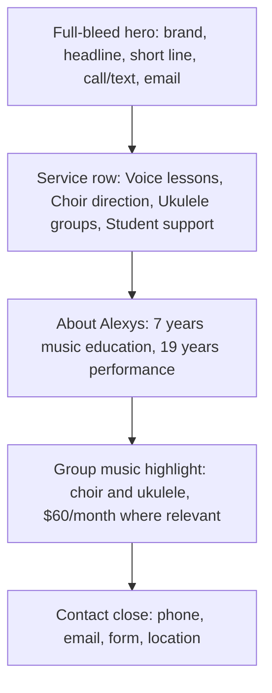

# Alexys Nevitt Voice Studio Website Plan

Date: 2026-06-03

## Goal

Create a usable first website for Alexys Nevitt Voice Studio LLC that helps local students, parents, and adult singers quickly understand what Alexys offers and contact her.

Primary outcome: more calls, texts, and emails from people in West Michigan who want voice lessons, choir direction, or beginner-friendly group music classes.

## Mode

New branded website build.

Workflow:

1. Build the first usable static site.
2. Keep the first viewport simple and memorable.
3. Use real contact paths.
4. Verify desktop and mobile behavior.

## User Lens

Who it is for:

- Parents looking for a kind music teacher for a teen.
- Adults who want to sing with more confidence.
- Schools, churches, and groups looking for choir direction.
- People curious about beginner ukulele or community music classes.

What they want:

- Know if Alexys teaches people like them.
- Know if lessons can be in person or online.
- Know how to reach her.
- Feel safe asking a basic question.

What they fear:

- Feeling judged.
- Not being good enough to start.
- Hidden costs or unclear class details.
- A cold, formal lesson setting.

Friction to remove:

- Too much text before contact info.
- Vague services.
- Unclear location.
- No clear call, text, or email path.

## Constraints

Platform:

- Existing repo is a Node static-site demo platform.
- Client sites live under `client-sites/<slug>`.
- Server routes selected static site folders manually.

Budget:

- First pass should be lightweight and fast to ship.
- No paid CMS, database, or booking system in this version.

Time:

- Build a complete one-page site now.
- Defer deeper features like class calendars, checkout, and student portal.

Technical:

- Static HTML/CSS/JS.
- Must work through the existing `server.js`.
- Images need to be local project assets.

Legal/compliance:

- Do not invent testimonials.
- Do not overclaim credentials beyond supplied details.
- Keep exact class location conservative because supplied sources conflict.

Existing system:

- Preserve existing Pure Pressure and other static sites.
- Add only one static route entry for this client.

## Known Facts

- Business name: Alexys Nevitt Voice Studio LLC.
- Location: Muskegon, MI / West Michigan.
- Phone: (231) 215-0166.
- Email: alexysrace@gmail.com.
- Website link: alexysnevittvoicestudio.com.
- Offers: private voice instruction and choir direction.
- Specialties: in-person classes and online classes.
- Experience: 7 years in music education and 19 years performance experience.
- Flyer offers: beginner ukulele, intermediate ukulele, summer choir.
- Flyer price: $60/month for listed group classes.

## Assumptions

- The first site should be a polished one-page marketing page, not a full booking platform.
- Call or text is the best primary action because the phone number is prominent.
- Email should be second because it gives parents and adult students a lower-pressure option.
- Group class details may change, so the first page should promote them without locking every schedule into the hero.

Fragile assumption:

- Exact class location is not placed in the main hero because the profile and flyers show different location details.

## Edge Cases

Content and trust:

1. Visitor only wants online lessons.
2. Visitor only wants in-person lessons.
3. Parent wants lessons for a teen.
4. Adult beginner feels nervous.
5. Visitor wants choir direction, not private lessons.
6. Visitor wants ukulele, not voice lessons.
7. Visitor wants current class times.
8. Visitor wants price before contacting.
9. Visitor wants to know if ages 12+ are welcome.
10. Visitor needs a warm tone, not a formal conservatory tone.
11. Visitor distrusts vague music school copy.
12. Visitor needs to know this is local to Muskegon.
13. Visitor lands from Facebook on mobile.
14. Visitor sees old flyers and asks if classes are current.
15. Visitor needs inclusive wording.

Contact:

16. Phone link must work on mobile.
17. Email link must open an email draft.
18. Contact form should not need a backend.
19. Missing form field should not block a simple email.
20. User may prefer text over call.
21. User may not know what service they need.
22. User may ask about group classes without choosing a schedule.
23. User may want choir direction for an organization.
24. User may want a trial lesson.
25. User may ask about pricing beyond group classes.

Responsive and access:

26. Hero headline must fit on small phones.
27. Buttons must not overflow.
28. Header must not cover content.
29. Form labels must remain readable.
30. Background photo must not hide text.
31. Motion must respect reduced-motion users.
32. Color contrast must work over the hero.
33. Keyboard focus must be visible.
34. Skip link should reach contact.
35. Footer contact should stay usable on mobile.

Static platform:

36. Route must not break existing client site.
37. Asset paths must be relative to the client folder.
38. Static caching should still serve CSS, JS, and images.
39. Unknown subpaths should fall back to this site's index.
40. Local dev server should load the new route.

SEO and sharing:

41. Title must include business and location.
42. Description must be plain and clear.
43. LocalBusiness schema should avoid invented data.
44. Open Graph image should use a local image.
45. Canonical URL should match the likely path-based preview.

Visual:

46. Page must not feel like generic SaaS.
47. Brand name must be a hero-level signal.
48. Hero should feel like one composition.
49. Services should be clear without card clutter.
50. Visuals should show music context, not abstract decoration alone.

## 80/20 Design Cut

All ideas considered:

- Full-bleed studio hero.
- Large brand name.
- Direct call/text CTA.
- Email CTA.
- Service anchor row.
- Short teacher/about section.
- Group class highlight.
- Choir direction section.
- Pricing table.
- Booking calendar.
- Student portal.
- Long FAQ.
- Testimonials.
- Social feed.
- Class schedule grid.
- Blog.
- Video samples.
- Downloadable flyer gallery.
- Newsletter.
- Payment links.
- Map section.

Do now:

- Full-bleed studio hero.
- Clear service row.
- Short trust/about section.
- Group music highlight.
- Contact form with phone and email.

Do later:

- Live class schedule.
- Pricing details by service.
- Testimonials once verified.
- Booking calendar if Alexys wants it.
- Map if exact public location is confirmed.

Maybe:

- Flyer download area.
- Short FAQ.
- Video performance or teaching clip.

Never for v1:

- Student portal.
- Complex CMS.
- Fake testimonials.
- Dense stats strip.
- Generic icon wall.

Why this path wins:

- It gets people to contact Alexys faster.
- It shows warmth and trust without clutter.
- It avoids stale schedule/pricing risk.
- It fits the existing static platform.

Evidence that would prove this wrong:

- Alexys already has a live booking system that must be the main CTA.
- Exact class schedules are stable and must be front-page content.
- Most traffic comes from organizations booking choir direction, not students.

## Options Considered

### Option A: Warm one-page studio site

Build one polished page with hero, services, about, class highlight, and contact.

Pros:

- Fast.
- Clear.
- Low maintenance.
- Good fit for a small local service.

Cons:

- No live booking.
- Class schedule remains high level.

### Option B: Class-first landing page

Make ukulele and choir classes the main offer.

Pros:

- Good if group classes drive most revenue.
- Can focus on the $60/month offer.

Cons:

- Private voice instruction becomes secondary.
- Schedule details may go stale.

### Option C: Full music school microsite

Multiple pages for lessons, choir, classes, about, contact, FAQ, and pricing.

Pros:

- More depth.
- Better if business has many programs.

Cons:

- Slower.
- More maintenance.
- Too much for a first pass.

Recommended: Option A.

## Wireframe



Desktop sketch:

```text
+------------------------------------------------------------+
| Alexys Nevitt Voice Studio        Lessons Choir Contact CTA |
|                                                            |
|  Alexys Nevitt Voice Studio        [warm studio image]      |
|  Find your voice.                  [teacher + piano]        |
|  Make music with others.                                   |
|  Short line                                                |
|  [Call/Text] [Email]                                      |
+------------------------------------------------------------+
| Voice lessons | Choir direction | Ukulele groups | Support |
+------------------------------------------------------------+
| About Alexys text                   Small warm proof points |
+------------------------------------------------------------+
| Group music highlight                                      |
+------------------------------------------------------------+
| Contact form + phone/email/location                        |
+------------------------------------------------------------+
```

Mobile sketch:

```text
+--------------------------+
| Brand           Call     |
| Hero text                |
| Buttons full width       |
| Hero image crop          |
| Services stacked         |
| About                    |
| Group class highlight    |
| Contact form             |
+--------------------------+
```

## Implementation Plan

1. Add `client-sites/alexys-nevitt-voice-studio`.
2. Copy generated design reference into `assets/reference`.
3. Add generated hero image into `assets/photos`.
4. Create `index.html` with SEO metadata, LocalBusiness schema, hero, services, about, classes, contact, and footer.
5. Create `styles.css` with defined CSS variables, expressive fonts, full-bleed hero, responsive layout, and reduced motion support.
6. Create `script.js` with header scroll state, mailto form, and reveal animation.
7. Register route in `server.js`.
8. Run local server.
9. Verify route, desktop, mobile, and contact links.

## Risks

- Generated hero image resembles Alexys but is not a real approved photo.
- Class price and schedules may change.
- Exact class address should be confirmed before publishing.
- Phone/email mailto flow depends on the visitor device.
- Google Fonts require network access.

## Regression Check

Likely breakpoints:

- `server.js` route map.
- Relative asset paths.
- Mobile header width.
- Contact form mailto encoding.
- Hero text contrast over image.
- Existing static-site routes.

Backward compatibility:

- Existing routes remain unchanged.
- New site is additive.
- No data model changes.

## Acceptance Criteria

- Alexys route loads at `/alexys-nevitt-voice-studio/`.
- First viewport clearly shows the brand, offer, and contact actions.
- Services are visible without scrolling too far.
- Phone and email links use the supplied contact info.
- Contact form opens a prefilled email.
- Mobile layout has no text overlap.
- Existing static routes still load.
- Site uses local image assets.
- No fake testimonials or invented claims.

## Next Actions

Now:

- Build and verify the static page.

Later:

- Confirm exact address and class schedule.
- Add real testimonials.
- Add booking or payment only if Alexys wants it.

Maybe:

- Add a small FAQ once common questions are known.

Never:

- Add filler stats, fake reviews, or a complex portal in v1.
